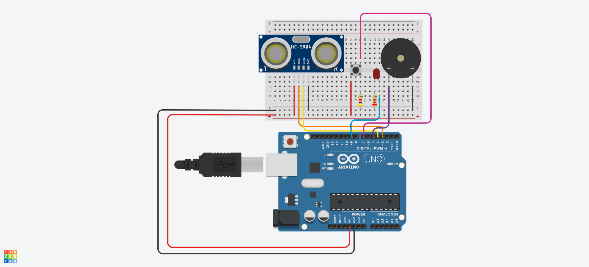

# UltraSonic
Various_UltraSonic_Arduino

## 준비물
  + 아두이노Uno보드, 브래드보드, LED, Button, Piezo, 초음파센서, 4.7kΩ, 220Ω 저항 한개씩, 점퍼선 
  
## 기능
|Pin number|Name|Function|
|------|---|---|
|3,4|UltrasonicSensor|거리감지|
|7|Button|버튼기능|
|9|LED|발광기능|
|11|Piezo|소리|

## TinkerCad

+ **UltraSonic_LED**
  + trigPin 3번핀에 연결, echoPin 4번핀에 연결, led 9번핀에 연결
  + 초음파센서로부터 거리가 15cm보다 작을 때 LED가 켜진다. 
  
+ **UltraSonic_Piezo_LED**
  + trigPin 3번핀에 연결, echoPin 4번핀에 연결, led 9번핀에 연결, Piezo 5번 핀에 연결, 
  + 초음파센서로부터 거리가 20cm보다 작을 때 LED가 켜지고 Piezo에서 소리가 난다.
    + pitches.h파일을 사용(헤더파일)
    
+ **UltraSonic_ButtonStart_Piezo**
  + trigPin 3번핀에 연결, echoPin 4번핀에 연결, Piezo 5번 핀에 연결, ButtonPin 7번핀에 연결
  + 버튼이 눌렸을 때 초음파센서 작동
  + 초음파센서로부터 거리가 20cm보다 작을 때 Piezo에서 소리가 난다.
    + pitches.h파일을 사용(헤더파일)
    
+ **UltraSonic_Piezo_DistnaceVariation**
  + trigPin 3번핀에 연결, echoPin 4번핀에 연결, Piezo 5번 핀에 연결, led 9번핀에 연결
  + 거리에 따라 초음파센서의 작동이 달라진다.
  + 초음파센서로부터 거리가 50cm보다 작을 때 Piezo의 빈도가 적게 소리나고, 25cm보다 작을 때 빈도가 크게 소리난다.
  + 거리가 10cm보다 작을 때는 계속 소리가 난다.
    + pitches.h파일을 사용(헤더파일)
